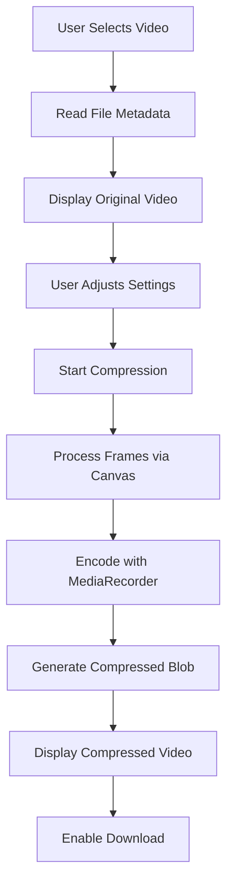

# Browser Video Compressor 🎥

A powerful client-side video compression tool that reduces file sizes by up to 90% without uploading to any server! Built entirely with HTML, CSS, and JavaScript.

## Features ✨

- **100% Client-Side Processing** - Videos never leave your device
- **1GB File Support** - Compress large videos with ease
- **Adjustable Compression** - Control quality (10-90%) and resolution (360p-1080p)
- **Real-Time Previews** - Compare original and compressed videos
- **Visual Progress Tracking** - See compression progress in real-time
- **Size Savings Calculation** - Know exactly how much space you're saving
- **Modern UI** - Beautiful gradient design with intuitive controls
- **Privacy Focused** - No server uploads, no tracking
- **Multiple Formats** - Output as WebM or MP4

## Live Demo

[Try it now!](https://mrp44rth.github.io/videocompressor) (Host this HTML file anywhere)

## How to Use 🚀

1. **Select a video** (up to 1GB) by clicking the upload area or dragging a file
2. **Adjust compression settings** using the quality and resolution sliders
3. **Click "Compress Video"** and watch the progress bar
4. **Preview the result** in the compressed video player
5. **Download your compressed video** with the download button

## Run Locally

1. Save the HTML code as `index.html`
2. Open it in any modern browser (Chrome/Firefox recommended)

Technical Implementation 🔧
This innovative tool uses browser APIs to process videos directly on your device:

## Technical Implementation 🔧

This innovative tool uses browser APIs to process videos directly on your device:

## Browser Support 🌐

| Browser       | MediaRecorder | Canvas | WebM | MP4 |
|---------------|---------------|--------|------|-----|
| Chrome        | ✅ 89+        | ✅     | ✅   | ✅  |
| Firefox       | ✅ 78+        | ✅     | ✅   | ⚠️  |
| Edge          | ✅ 93+        | ✅     | ✅   | ✅  |
| Safari        | ⚠️ Limited    | ✅     | ❌   | ✅  |
| Mobile Chrome | ✅ 90+        | ✅     | ✅   | ✅  |
| iOS Safari    | ⚠️ Partial    | ✅     | ❌   | ✅  |

**Note:** For best results, use Chrome or Firefox. Safari has limited MediaRecorder support.
